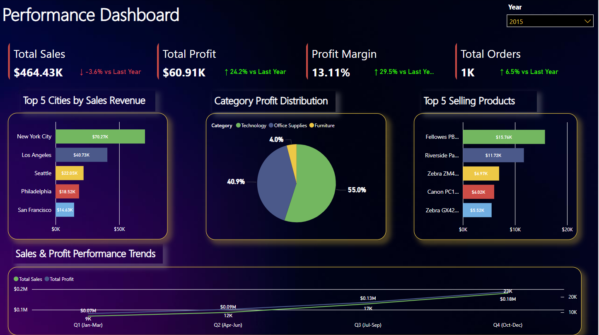
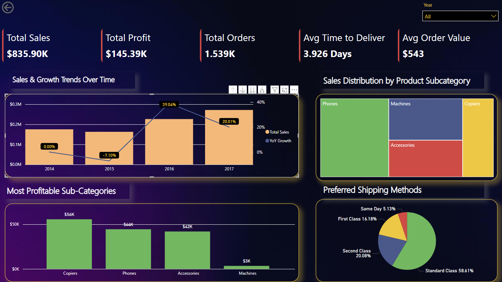
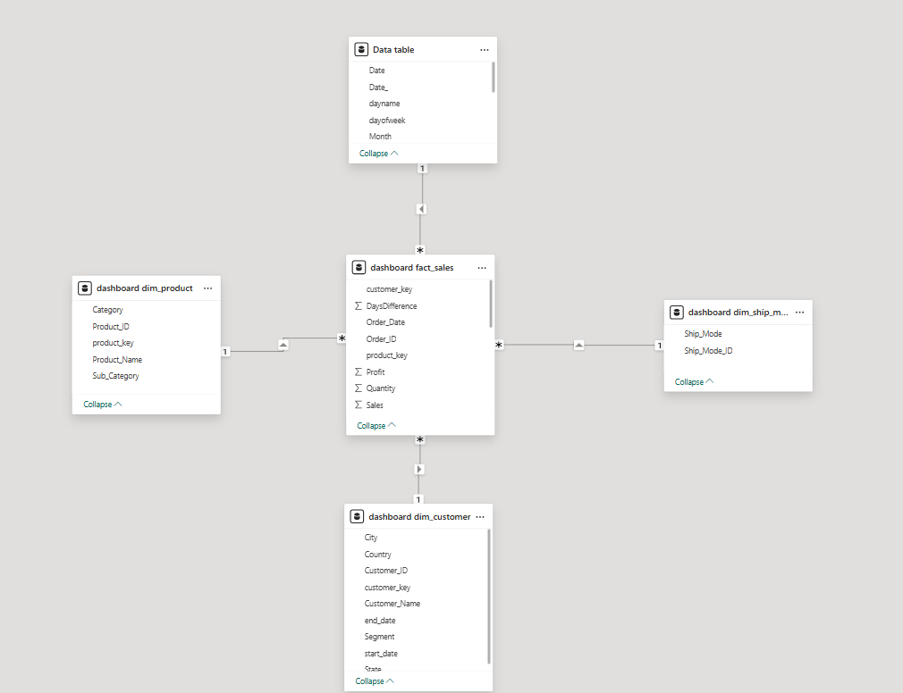

# Sales Analytics Dashboard
A business intelligence solution for tracking sales and profit performance with interactive visualizations.

# Overview
This dashboard provides key business metrics and analytics to support data-driven decision making. It features interactive visualizations with drill-through functionality for analyzing sales by product categories, time periods, and geographic regions.

# Features

* Performance Metrics: Track total sales, profit, orders, delivery times, and average order values
* Interactive Visualizations: View sales trends, product category distribution, and shipping preferences
* Geographic Analysis: See top performing cities.
* Time Analysis: Filter data by year and analyze quarterly performance
* Category Analysis: Drill down into product categories.

# Data Model
  ## Built on a star schema with:

   * Central fact table (dashboard_fact_sales) containing sales metrics
   * Dimension tables for time, products, customers, and shipping methods
   * Relationships enabling multi-dimensional analysis

# Technology

* Data visualization: Power BI
* Data storage: MySQL Database

<video src='Dashboard.mkv' width=180/>

  
  
  
